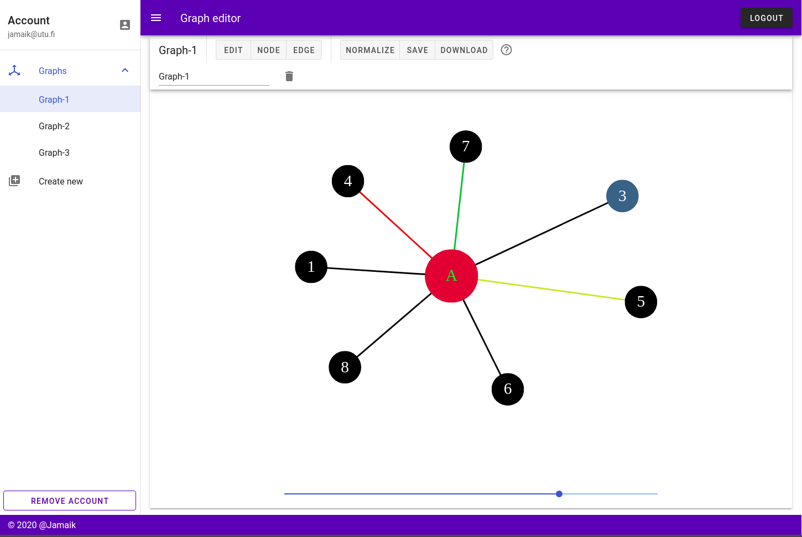

# Graph-editor-app
#### A dockerized fullstack web-development project using Vue, Express and Postgres.

The app allows users to create graphs and save them to a database. It also allows users to download the created graphs as an svg-image.



The production version of this app is running on a free-tier Amazon ec2-instance in
http://3.125.137.206:3000 . I will take the app down at some point in the near future.

## Quick start
  1. Clone this repo.
  1. Install [docker](https://docs.docker.com/get-docker/) and [docker-compose](https://docs.docker.com/compose/install/).
  2. Run the command `docker-compose up --build` in a terminal.
  3. Open http://0.0.0.0:3000 in a browser.

## Services
This project includes multiple services:
  - [ui](./ui/index.md) is the user-interface.
  - [api](./api/index.md) is the express-server that handles requests from the ui.
  - [database](./database/index.md) contains a postgres-database used in development and testing. The production database is in AWS.
  - [migrate](./migrate/index.md) is a migration and testing tool for the database.
  - [e2e](./e2e/index.md) contains end-to-end tests written with [cypress](https://www.cypress.io/).

## Dependencies
This project requires an installation of [docker](https://docs.docker.com/get-docker/) and [docker-compose](https://docs.docker.com/compose/install/).

Understanding this project requires a bit of prior experience with docker. It would probably make sense to create some bash-scripts for easier usage.

## System requirements
This project has been written on a Ubuntu 18.04 laptop with 32gb of memory and an Intel i5-processor. The development environment would probably need at least 2gb of free ram for the whole stack. Also the build-processes might take a while on slower computers.

Running this project on Windows is not wise and will probably not work. It should work on linux-based systems straight out of the box. If using Windows, you can try to run the project on a local linux virtual-machine.

## CI/CD
The project uses a gitlab-pipeline that:
  1. builds the docker-images and saves them to a container-registry on gitlab.
  2. Runs the test script.
  3. If on `master`, it deploys the changes to the ec2-instance.

Note that the master-branch is protected from other users.

## Running the app
Run these commands from the root-directory of this project.

The app uses different docker-compose*.yml files depending on the environment:
  - `docker-compose.yml`: This base-file is the one used in production. Has only the services `api`, `ui` and `migrate`, since the postgres-database is not running with docker in production, and the end-to-end tests aren't run against the production-app.

  - `docker-compose.override.yml`: The development-environment file that is merged automatically with the base-file. Has the postgres-service and the other services use docker-volumes for quicker development. When using volumes, we don't need to build the image every time the code is changed. Also the `ui` and `api` listen to file-changes and restart.

  - `docker-compose.test.yml`: Like the development environment, but it doesn't use volumes, since volumes break the gitlab-ci. It also runs the `e2e`-service with headless-chrome.

  - `docker-compose.preview.yml`: Mimicks the production environment, but still uses the local postgres-service. The `ui` and `api` are bundled and minified to the production versions.

Different environments can be achieved by using different combinations of the compose-files. (https://docs.docker.com/compose/extends/#multiple-compose-files)


### Development environment
```bash
# build the stack
docker-compose build

# run the stack
docker-compose up

# Restart
docker-compose down
docker-compose up
```

### Production-preview environment
```bash
# build the stack
docker-compose -f docker-compose.yml -f docker-compose.preview.yml build

# run the stack
docker-compose -f docker-compose.yml -f docker-compose.preview.yml up
```

### Test environment
```bash
# build the stack
docker-compose -f docker-compose.yml -f docker-compose.test.yml build

# run the stack
docker-compose -f docker-compose.yml -f docker-compose.test.yml up
```

The test environment is a bit tricky, since the cypress tests need everything else to be running before they can work. A workaround for this is to first start all but the `e2e`-service. Once they are running you can run the tests:

```bash
# STEP-1: run all but the e2e.
# Possible to use dev- or preview-environments here also.

# dev environment
docker-compose up
# OR preview
docker-compose -f docker-compose.yml -f docker-compose.preview.yml up

# STEP-2: run e2e when everything else is ready
docker-compose -f docker-compose.yml -f docker-compose.test.yml run --rm e2e
```

This is a bit verbose. An easy way to run the tests is to use the `test.sh` script. It runs the unit tests and the integration tests for the whole stack. The script is used in the gitlab-pipeline and is also useful for development:

```bash
# Run all tests.
./test.sh

# You may need to give permissions for running this script. If so:
chmod +x test.sh
```

NOTE: After running the test script you may need to rebuild the stack, since it builds the services to a different target.
